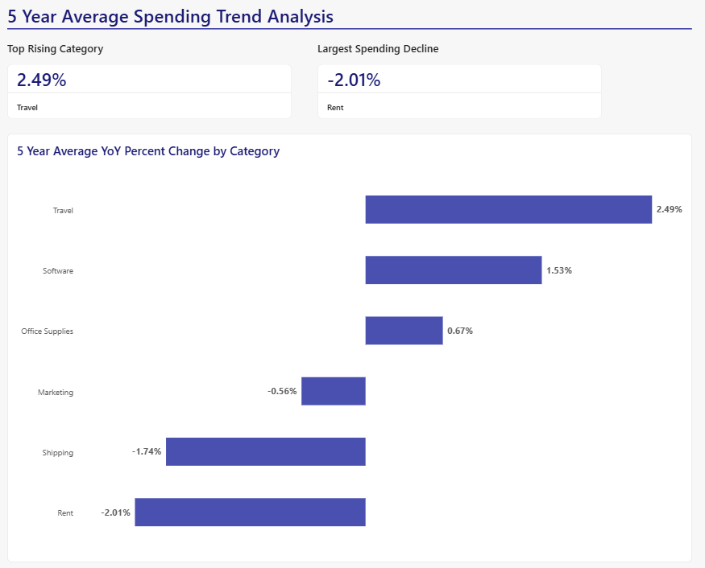

# 5-Year Financial Spending Trend Analysis

## Project Overview
A financial data pipeline analyzing a 5-year transactional dataset to extract annual spend metrics and compute the average year-over-year percent changes across various business categories. 

## Dashboard Preview

## Tools
* **Microsoft SQL Server:** Used for data transformations and hosting the database view.
* **Power BI:** Used to create a visual representation of findings.

## Key Findings
The analysis revealed two main spending trends over the 5-year period:
* **Primary Growth Sector:** The **Travel** category experienced the highest historical change in spending, spiking by **+2.49%**.
* **Most Significant Cost Reduction:** The **Rent** category marked the largest historical spending decline, dropping **-2.01%**.

## How to View the Assets
1. Open '5yr_avg_spending.sql' to view the data cleaning and window function logic.
2. Open 'cleaned_results_preview.csv' to view the snapshot of the cleaned SQL output.
3. Open 'spending_trend_report.pdf' to view the completed PDF report.
4. Download 'spending_trend_dashboard.pbix' to view the original dashboard file.
